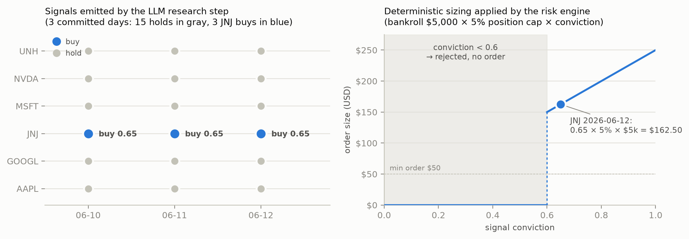

# Agentic Trading System

An LLM reads each morning's market data and news and proposes structured, cited
trade signals — then a fully deterministic risk engine validates, sizes, and gates
every one of them, so the model can *propose* but only auditable code can *dispose*.

> **⚠️ Research / educational project — not financial advice.**
> This system **does not and cannot execute real-money trades.** All order flow
> goes to [Alpaca's paper-trading environment](https://alpaca.markets/docs/trading/paper-trading/)
> (simulated money). Every order-touching script is double-gated: it hard-exits
> unless `config.yaml` says `mode: paper`, *and* it verifies at runtime that the
> constructed client points at `paper-api.alpaca.markets` before submitting
> anything. There is no live-trading code path to flip on — going live would
> require deliberate code changes gated by a human-owned
> [promotion checklist](PROMOTION_CHECKLIST.md). No performance claims are made;
> the system benchmarks itself against buy-and-hold VOO precisely so it can lose
> that comparison honestly.

## Quick start

Runs against committed historical data with **no API keys and no network**:

```bash
git clone <this repo> && cd trading-agent
python -m venv .venv && source .venv/bin/activate   # Python 3.11+
pip install -r requirements.txt

pytest                          # 96 tests, all offline (fake broker, tmp DBs)
python scripts/replay_day.py    # replay a real committed day through the
                                # actual validation + risk-rule code, read-only
```

To run the live (paper) pipeline you'd also need free Alpaca paper keys in
`.env` (see `.env.example`), but nothing in the quick start requires them.

## Example: headline in → signal → sized order out

Everything below is real committed state from **2026-06-12** (`data/`,
`signals/`, `reports/` are tracked in git — the audit trail is the repo).

**1. In:** `fetch_data.py` pulled JNJ's snapshot, including these headlines:

> *"Johnson & Johnson Says IMAAVY Showed Rapid And Durable Anemia Improvement
> In wAIHA, A Disease With No FDA-Approved Therapies"* — Benzinga, 06-11
>
> *"Johnson & Johnson Fined $32M From Los Angeles Jury Over 2024 Death … Due To
> Exposure To Asbestos-Contaminated Talc Product"* — Benzinga, 06-10

**2. Research:** the LLM weighed the catalyst stream against the litigation risk
and emitted this signal (`signals/signals_2026-06-12.json`) — note the
falsification condition and named sources; both are required by schema:

```json
{
  "ticker": "JNJ",
  "action": "buy",
  "conviction": 0.65,
  "thesis": "Catalyst stream intact: 06-11 IMAAVY hit target in wAIHA (rapid,
             durable anemia improvement; no FDA-approved therapies) [...] Close
             238.31 holds above the 230 falsification line in a weak tape (beta
             0.26). Falsified if close < 230 or talc litigation escalates beyond
             the 06-10 $32M LA mesothelioma verdict.",
  "sources": ["Benzinga 2026-06-11: Johnson & Johnson Hits Target With IMAAVY...", "..."]
}
```

**3. Out:** the deterministic engine validated the file against the schema,
checked conviction against the 0.6 floor, sized the order off the $5,000
bankroll (`$5,000 × 5% cap × 0.65 conviction = $162.50`), verified position/
sector/budget caps, and approved it — while the same day's five 0.5-conviction
hold signals produced no orders. Reproduce this yourself, offline:

```bash
python scripts/replay_day.py signals/signals_2026-06-12.json
# -> approved: [{"ticker": "JNJ", "side": "buy", "notional": 162.5, ...}]
# -> summary: 6 signals -> 1 approved, 0 rejected, 5 hold (no order)
```

Every verdict — approved or rejected, with its reason — is persisted to
`data/trades.db` and rendered into a daily digest
([example](reports/digest_2026-06-12.md)) alongside P&L vs a VOO buy-and-hold
counterfactual.



## How it works

- **The LLM proposes; deterministic code disposes.** A scheduled routine has
  Claude read the day's snapshots (prices, fundamentals, headlines) and write
  signals conforming to a strict JSON schema: ticker, buy/sell/hold, conviction
  0–1, a ≤500-char thesis with a falsification condition, named sources. The
  LLM never touches the broker API, position sizing, or risk limits.
- **The risk engine is plain, auditable rules** (`config.yaml` +
  `src/decision_engine.py`) — no ML: pydantic schema validation of the signals
  file as *untrusted input*; conviction-scaled sizing off a hard $5,000
  bankroll; 5% per-ticker and 20% per-sector exposure caps that count unfilled
  orders as exposure (a fill is never assumed); a 5-trades/day cap; an 8%
  stop-loss sweep that runs every day regardless of signals; a circuit breaker
  that freezes buys when the book is down >3% intraday. Any validation failure
  means *no trade plus a logged rejection* — never a guess.
- **Execution never assumes success**: idempotent client order IDs (a re-run
  cannot double-submit), submission-time re-validation against current limits,
  and polling every order to a confirmed terminal state.
- **Honesty mechanisms**: every decision is logged with the full reasoning
  chain that produced it; the daily digest compares cumulative P&L against a
  deposit-matched VOO counterfactual; and a one-command kill switch
  (`src/flatten.py`) closes everything.

## Limitations

- **The interesting layer is the one that can't be honestly backtested.** Any
  historical "LLM signal" is contaminated by training-data hindsight, so only
  the deterministic rules were backtested (2.9 years, vectorbt,
  [full write-up](docs/backtest_results.md) — max drawdown −4.7% vs VOO's
  −18.7%, all caps held; the P&L there is explicitly meaningless as evidence of
  edge). The LLM layer is validated only by forward paper trading.
- **Not validated against live capital.** Paper trading period is ongoing
  (started 2026-06-10). Paper-period results vs VOO: **[to be added after the
  evaluation window closes]**.
- **Daily cadence ignores microstructure**: no intraday reaction, latency,
  slippage, or realistic fill modeling — the backtest showed stops are a
  *trigger, not an exit price* (worst observed exit 17% below basis on an
  overnight gap, vs the nominal 8%).
- **Known policy gaps, documented rather than hidden** (see
  [backtest findings](docs/backtest_results.md)): winners can drift above the
  5% cap (nothing trims), a stopped name can re-enter the next day, and the
  sector cap is arithmetically unreachable until the watchlist grows.
- **No informational edge is claimed** from reading public news; if there is
  value, it comes from discipline and breadth, and the VOO benchmark exists to
  test exactly that.

## Architecture

```
fetch_data.py -> [LLM research step] -> decision_engine.py -> execute.py -> report.py
   data/           signals/*.json        approved orders     confirmed      reports/
 snapshots      (schema-validated)        in trades.db     (paper) fills   daily digest
```

| Module | Role |
|---|---|
| `src/fetch_data.py` | Market data + news ingestion (Alpaca IEX, yfinance fallback); per-ticker error manifest, fails loudly |
| `src/decision_engine.py` | The compliance desk: schema validation + every risk rule; SQLite decision log |
| `src/execute.py` | Paper-broker submission: double paper guard, idempotency, re-validation, fill confirmation |
| `src/report.py` | Daily digest + VOO counterfactual benchmark |
| `src/flatten.py` | Kill switch: cancel everything, close every position, full audit trail |
| `src/common.py`, `src/trading_day.py` | Shared plumbing; one definition of "today" (America/Chicago) |

Data sources: Alpaca paper API (market data, news, account state), yfinance
(fallback + fundamentals), web search in the research step. Secrets live only
in `.env` (gitignored); see `.env.example`.

## Tests

`pytest` — 96 tests, fully offline (fake broker client, temp databases, mocked
data sources). They assert the risk rules at their exact boundaries *against
the live `config.yaml` values*, so loosening a limit fails the suite; plus the
paper guard, order idempotency, kill switch, benchmark math, and the data
layer's fallback/error contract.

The optional rules backtest: `pip install -r backtest/requirements.txt`, then
`python backtest/backtest_rules.py`.

## Operations

A scheduled cloud routine (prompt: `ROUTINE_PROMPT.md`) runs the pipeline each
weekday pre-market and commits the day's state back to the repo — the repo is
the system of record. Submitting approved orders (`execute.py`) is deliberately
left as a manual, human-reviewed step. `CLAUDE.md` is the standing operating
contract for agent sessions; `docs/DESIGN.md` is the append-only decision log.
